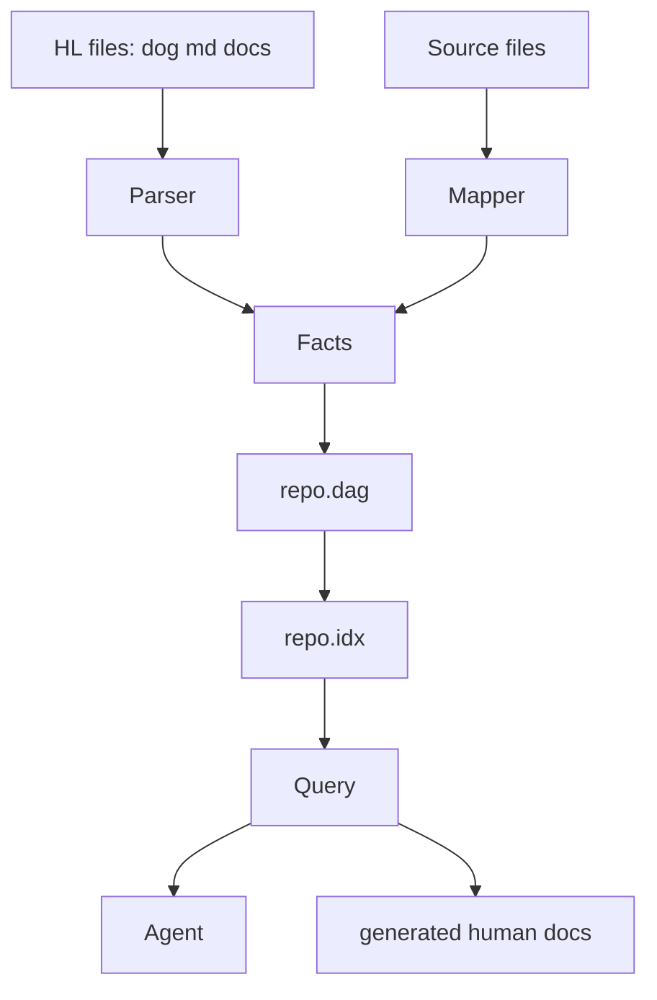

# dotdog Machine-First Implementation Plan

Status: working thesis and implementation map
Repo: specdog/dotdog
Purpose: evolve dotdog from a spec scaffolder into a machine-first repository memory, documentation, planning, and orchestration engine.

## Core thesis

dotdog should make every repository readable twice.

Human language, or HL, is for people: `.dog`, `.md`, README files, ADRs, comments, issues, examples, and narrative documentation.

Machine language, or ML, is for tools: `.dag`, `.idx`, graph indexes, manifests, hashes, traces, test facts, build facts, command facts, and queryable state.

The machine should search ML first. Humans should edit HL first. dotdog reconciles the two.

The npm package should not only scaffold new projects. It should ingest existing repositories, construct a living model of the app, detect drift, model likely outcomes, and expose the result through CLI and MCP-compatible query surfaces.

## Machine-first doctrine

The doctrine is efficiency through stable context and deterministic local tools.

- Do not make an LLM reread the same repository every time.
- Cache stable context into compact machine structures.
- Separate stable facts from dynamic outputs.
- Use local deterministic analysis before model reasoning.
- Let the model reason over the smallest truthful graph, not the largest pile of files.
- Preserve human intent in readable files, but give agents compressed structures for execution.

This mirrors the Sawyer RollerCoaster Tycoon assembly analogy: maximum behavior from minimum moving parts.

## World model

The `.dag` file is more than documentation. It is a compact model of repository state.

Human files explain intent. Machine files store facts, edges, hashes, commands, tests, docs, generated outputs, and observed traces.

Agents should query the machine model before reading markdown or source files.

The goal is a programmatic world model: a structured matrix of what exists, what relates, what changed, what is proven, what is assumed, and what is unknown.

## World model matrix

Files: path, hash, language, size, role.

Symbols: functions, classes, exports, schemas, commands, routes, public APIs.

Relations: imports, packages, commands, specs, tests, docs, generated outputs.

Specs: entities, invariants, constraints, required behavior, forbidden drift.

Tests: test files, fixtures, assertions, coverage links, expected commands.

Builds: scripts, outputs, generated files, package entry points.

Docs: README claims, examples, service pages, roadmap claims, API descriptions.

Changes: file hash delta, graph delta, doc delta, spec delta.

Predictions: affected modules, affected docs, affected tests, required checks, confidence label.

Unknowns: missing specs, missing tests, unlinked docs, ambiguous claims, external assumptions.

## Prediction and simulation

dotdog should model likely software outcomes before a change is accepted.

This is not mystical certainty. It is deterministic certainty inside known program boundaries.

If dotdog knows files, symbols, scripts, graph edges, package metadata, tests, build outputs, docs, and specs, it can compute many outcomes without invoking an LLM.

Examples:

- A changed public export maps to import sites.
- A changed CLI command maps to docs, examples, and tests.
- A changed package field maps to release metadata and npm surface.
- A changed spec invariant maps to missing tests and stale docs.
- A changed file hash maps to the affected DAG subgraph.

Each modeled outcome should have a confidence label:

- certain: directly derived from graph facts.
- likely: derived from strong heuristics.
- unknown: requires runtime, human input, or model reasoning.

## DAG-first query path

The agent path should be:

1. Read `.dag` or `.idx`.
2. Query facts and edges.
3. Return exact source references.
4. Fall back to `.dog` or `.md` only when ML lacks evidence.
5. Fall back to source files only when HL also lacks evidence.
6. Ask an LLM only after deterministic context is minimized.

## Target CLI surface

`dotdog init` creates a spec workspace for new projects.

`dotdog map [dir]` ingests an existing repository and emits graph facts.

`dotdog compile` compiles HL into ML.

`dotdog query <question>` queries the DAG before reading large text files.

`dotdog watch` updates only changed graph regions.

`dotdog explain` renders ML back into human-readable documentation.

`dotdog doctor` reports missing specs, stale docs, missing tests, and graph drift.

`dotdog simulate <change>` models likely affected files, commands, docs, and checks.

## Implementation phases

### Phase 0: product spine

Define dotdog as: repo DAG, living docs, and machine-first agent memory.

Deliverables:

- Keep this plan in `docs/dotdog-machine-first-implementation-plan.md`.
- Update README with the HL/ML thesis.
- Make package messaging clear: existing repos first, scaffolding second.

### Phase 1: typed DAG schema

Create a stable internal schema for facts and edges.

Minimum node types:

- file
- symbol
- command
- package
- spec
- test
- doc
- build
- output
- external

Minimum edge types:

- imports
- exports
- defines
- mentions
- tests
- builds
- documents
- depends_on
- generated_by
- changed_with

Deliverables:

- `src/dag/schema.ts`
- validation helpers
- stable JSON serialization
- deterministic ordering

### Phase 2: repository mapper

Make `dotdog map` useful on any existing repo.

Deliverables:

- file scanner with ignore rules
- package.json analyzer
- TypeScript import/export analyzer
- README/docs claim extractor
- test file linker
- command/script extractor
- generated `specs/<project>/repo-map.dog`
- generated `specs/<project>/repo.dag`

### Phase 3: query engine

Add deterministic graph search before text search.

Deliverables:

- `dotdog query`
- exact node and edge lookup
- path lookup
- symbol lookup
- command lookup
- doc claim lookup
- source references in output

### Phase 4: simulation engine

Add deterministic impact modeling.

Deliverables:

- graph delta from changed files
- affected imports
- affected commands
- affected docs
- affected tests
- required checks
- confidence labels

### Phase 5: living documentation

Make docs regenerate from graph truth.

Deliverables:

- `dotdog explain`
- generated architecture overview
- generated command reference
- generated package surface summary
- generated stale-doc report

### Phase 6: MCP and agent surface

Expose the DAG as an agent-readable tool surface.

Deliverables:

- MCP server or adapter
- query endpoint
- file reference endpoint
- graph neighborhood endpoint
- simulation endpoint

## Verification checklist

The package is useful when it can answer these without reading the whole repo:

- What commands exist?
- What package is published?
- What files define the CLI?
- What docs mention a command?
- What tests cover a command?
- What changes when a public symbol changes?
- What files are stale against the graph?
- What should an agent read first?
- What can be skipped safely?

## Missing-risk audit

Potential missing areas:

- binary and asset files
- generated files
- monorepo packages
- private packages
- non-TypeScript languages
- runtime configuration
- environment variables
- CI workflows
- issue and PR knowledge
- website claims versus package claims
- MCP tool schema drift

These should become graph layers, not ad hoc prose.

## Final objective

dotdog should become the best npm package for turning any repository into a living, queryable, machine-first world model.

It should let humans write intent, machines read graphs, and agents act with less context, less drift, and more certainty.
